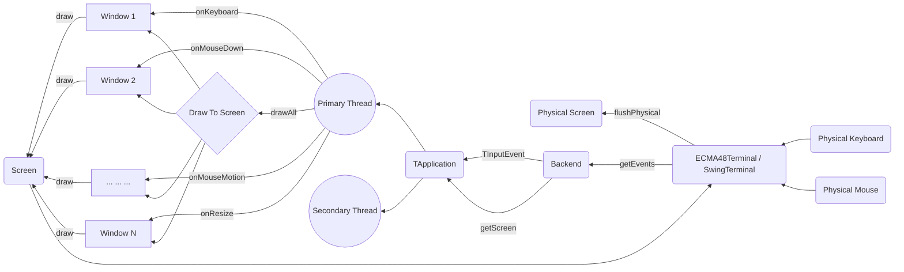
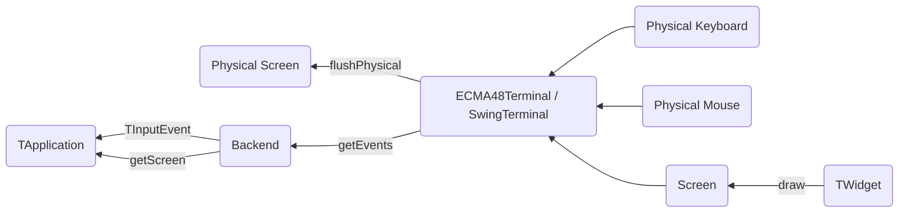

Jexer's High-Level Design
=========================

Jexer has three major areas of function: user-facing input/output (events and screen), window management (TApplication), and widgets (TWidget) and windows (TWindow).  This document describes in a general manner what these pieces do and how they communicate.

The Big Picture
---------------

Events And Screen
-----------------

Input and output to the "physical" devices occur via received *events* and updates to the *screen*:

* Events are received by calling jexer.backend.Backend.getEvents(), which puts any events into a list for higher layers to process.

* Backend.getScreen() returns a jexer.backend.Screen interface that has functions for drawing characters, strings, and lines to a logical screen buffer.  When it is time to push that logical buffer to the physical screen, Screen.flushPhysical() is called.  The SwingTerminal and ECMA48Terminal (Xterm) backends have logic to reduce the amount of actual data that must be drawn or emitted to the terminal.

Pictorially, the data flow looks like this:

The jexer.backend package can be used standalone to provide keyboard, mouse, and screen support for any kind of application.  For an example of using the Swing backend without any of the rest of Jexer, [see here](https://gitlab.com/klamonte/jermit/blob/master/src/jermit/ui/qodem/QodemUI.java).

Events are always concrete subclasses of abstract class jexer.event.TInputEvent.  In addition to mouse press/release/movement and keyboard presses, events are also generated for resizes (screen and widget), menu selection, and general-purpose "command" events.

Screens encapsulate a two-dimensional grid of cells.  Any number of actions can be performed on the screen, but none will be visible to the end user until flushPhysical() is called.

Screen and Backend are both interfaces, so interesting things can be done by composition:

* MultiBackend and MultiScreen multiplex a single TApplication to multiple terminals.  This is demonstrated by jexer.demos.Demo5: a single TApplication has *three* screens that can manipulate it: one Swing screen, one ECMA48 screen, and another Swing screen showing the application running inside a window.  Keyboard and mouse events from any of these screens will update all of them at once.  One could use MultiBackend/MultiScreen to build a detachable long-running application.

* TWindowBackend performs user I/O of a Backend within the window of a different TApplication.

Window Management
-----------------

Widgets And Windows
-------------------

