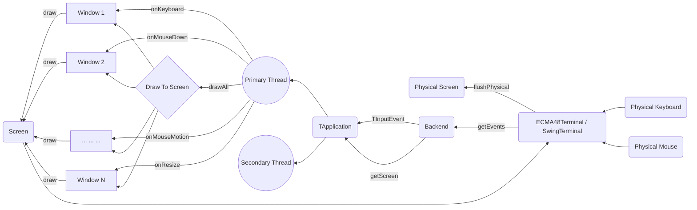
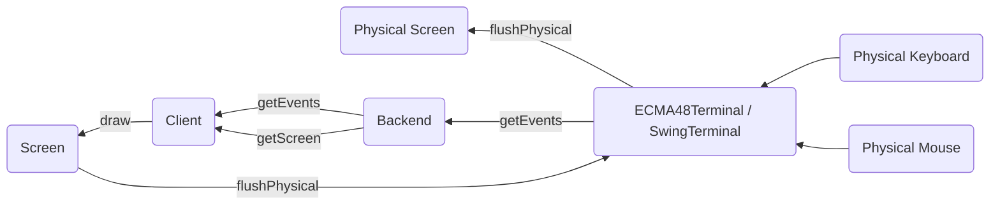

Jexer's High-Level Design
=========================

Jexer has three major areas of function: user-facing input/output
(events and screen), window management (TApplication), and widgets
(TWidget) and windows (TWindow).  This document describes in a general
manner what these pieces do and how they communicate.

The Big Picture
---------------

Events And Screen
-----------------

Input and output to the "physical" devices occur via received *events*
and updates to the *screen*:

* Events are received by calling jexer.backend.Backend.getEvents(),
  which puts any events into a list for higher layers to process.

* Backend.getScreen() returns a jexer.backend.Screen interface that
  has functions for drawing characters, strings, and lines to a
  logical screen buffer.  When it is time to push that logical buffer
  to the physical screen, Screen.flushPhysical() is called.  The
  SwingTerminal and ECMA48Terminal (Xterm) backends have logic to
  reduce the amount of actual data that must be drawn or emitted to
  the terminal.

Pictorially, the data flow looks like this:

The jexer.backend package can be used standalone to provide keyboard,
mouse, and screen support for any kind of application.  For an example
of using the Swing backend without any of the rest of Jexer, [see
here](https://gitlab.com/AutumnMeowMeow/jermit/blob/master/src/jermit/ui/qodem/QodemUI.java).

Events are always concrete subclasses of abstract class
jexer.event.TInputEvent.  In addition to mouse press/release/movement
and keyboard presses, events are also generated for resizes (screen
and widget), menu selection, and general-purpose "command" events.

Screens encapsulate a two-dimensional grid of cells.  Any number of
actions can be performed on the screen, but none will be visible to
the end user until flushPhysical() is called.

Screen and Backend are both interfaces, so interesting things can be
done by composition:

* MultiBackend and MultiScreen multiplex a single TApplication to
  multiple terminals.  This is demonstrated by jexer.demos.Demo6: a
  single TApplication has *three* screens that can manipulate it: one
  Swing screen, one ECMA48 screen, and another Swing screen showing
  the application running inside a window.  Keyboard and mouse events
  from any of these screens will update all of them at once.  One
  could use MultiBackend/MultiScreen to build a detachable
  long-running application.

* TWindowBackend performs user I/O of a Backend within the window of a
  different TApplication.

Widgets And Windows
-------------------

Above the backend layer, Jexer organizes things into *widgets*
(TWidget subclasses) and *windows* (TWindow subclasses).  The key
principles of these objects are:

* TWidgets receive events and draw things to a TWindow.  A TWidget can
  have zero or many "child" widgets.  Every widget has a "parent"
  TWidget.  This hierarchy is used to route input events to the
  lowest-level widget to handle it.  On the drawing side, the
  hierarchy is drawn in a top-down manner, such that a parent widget
  draws what it needs first, and then its children are drawn, with
  each of those drawing its children, and so on.
  TWidget.drawChildren() contains code that sets up offset and
  clipping, so that the TWidget.draw() methods can assume that
  coordinate (0, 0) is the top-left corner.

* TWindows organize TWidgets into layered panels that can be moved,
  resized, and hidden.  TApplication manages the TWindows, routing
  user events to the active window, and drawing them in reverse Z
  order so that the active window gets drawn last (painter's
  algorithm, with positive Z pointing away from the user: Jexer's
  coordinate system is right-handed).

Both TWidget and TWindow are legitimate "God classes", they each have
code to do far more than a typical Java object should.  This is rather
common for a windowing system, as there are a great many corner cases
to a smoothly functioning mouse-supporting "graphical" user interface.

Most of Jexer's user interface elements are TWidget subclasses,
intended to be composed to make bigger applications.  A few more
complex elements are full windows: the operating shell terminal window
(a vttest-passing terminal emulator in its own right, capable of
running Jexer inside itself), font chooser, color theme editor, Java
exception dialog, modal message box, and modal file chooser.  Some
elements come in both flavors -- as a widget that can be put anywhere,
and as a window that provides a good out-of-the-box experience: a text
editor, image viewer, and data table.

Window Management
-----------------

A significant part of TApplication's code is managing multiple
TWindows.

Text Cells
----------

The text cell model is this:

* A Cell can have text AND image data.  The text is a single
  codepoint, which is a gross oversimplification preventing the use of
  color emojis 🙁 .  The image is a "cell-sized" RGBA bitmap.  When an
  image is set on a Cell, the hash code for that image is removed, and
  the flag indicating whether it has transparent pixels is reset to
  "unknown".

* The internal cell size in pixels for single-head applications is the
  same as that provided by the terminal.  For multi-head applications,
  it is a virtual size that is the smallest size in each height/width
  dimension for all the attached heads.  The result of this is that
  images can get bigger when scaled to an output screen, but never
  smaller -- hopefully preventing missing information.

* The logical screen is built up on every frame by having every
  widget/window draw in reverse-Z-order (the coordinate space is
  right-handed, so positive Z is away from the user).  Any Cell can
  cover any other Cell during this.  During this phase the Cell might
  have an image transparency check: if it does then the result of that
  is cached.  This puts all the penalty on the first frame: on
  subsequent frames each widget will "know" which Cells are
  transparent.

* Currently there are three paths for a partially-transparent image to
  cover another image, in the "tackboard" which can place arbitrary
  bitmaps anywhere; in the terminal widget; and when blending
  translucent windows on the screen.  At these points it blits one
  image over the other, and handles alpha blending too.  All other
  paths to generate image data will either set a Cell to text, or an
  image, but not an image-over-image.  This is just an artifact of how
  Jexer got here though and not a specific design choice.  If Jexer
  gets another widget/object that can put image-over-image, then it
  will need to handle image-over-image at that spot too.

* Once the logical screen is fully assembled, the image goes to the
  output heads which can be a mix of GUI/Swing or Xterm screens.

* For a GUI/Swing screen, Jexer has to build the whole frame (Swing by
  default is triple-buffered) and then push the frame to the actual
  OS.

* For an Xterm screen, ideally only the changed Cells (text or image)
  will be output.  Jexer outputs all images first, and then all text -
  this seems to produce the least flicker on real terminals.  It will
  also do Synchronized Output when it detects support for that.

* For Cells containing images, consecutive horizontal Cells with
  images are concatenated into one image.  At this time the hash code
  for the image cells is computed and checked against the LRU cache.
  If the image is in cache, then that result is pulled out, wrapped in
  the cursor position and DCS/ST, and sent out.

* Otherwise, for multihead system the image is then rescaled to match
  the cell aspect ratio of the final terminal.  The (maybe-rescaled)
  image is then converted to sixel/Jexer/iTerm2, and the final string
  (minus cursor position and DCS/ST start/end) in put into a LRU
  cache.

* The result is that no image is ever taller than a single text cell,
  but can extend across the entire screen (or 1000 max pixels due to
  xterm).  The image can also be as small as a single text cell.

* Any rows that contained image data that have any different Cells on
  _this_ frame will have _all_ of the images on that row re-drawn, in
  case some of the text that was drawn earlier obscured an image from
  _some_ previous frame.  It's really unknowable what the terminal
  will do to partially-overwritten images, so Jexer takes that choice
  away from them and blow every potentially-different image away.

I settled on the horizontal strips option because I could not easily
figure out a damage map that would produce an optimal number of
rectangular images to cover the changed Cells, while also ensuring
that images from _any_ previous frame that were covered by text in
_this_ frame are also _fully_ included in said damage map.  With the
strips, it is easier to reason about what will actually need to be
redrawn.

A very nice side effect of the horizontal strips output is that
different sixel palettes can be generated for each row.  For sixel
encoders that generate their own per-image palettes (including
jexer.backend.HQSixelEncoder), it results in an apparent bit depth
much higher that the per-image bit depth.  The screen below is using
256-color palettes for each strip, yet it almost looks like 16-bit
depth:

😻
