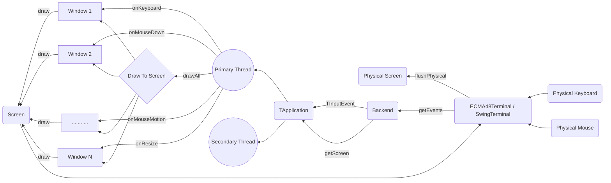

Jexer's High-Level Design
=========================

Jexer has three major areas of function: user-facing input/output (events and screen), window management (TApplication), and widgets (TWidget) and windows (TWindow).  This document describes in a general manner what these pieces do and how they communicate.

The Big Picture
---------------

Events And Screen
-----------------

Window Management
-----------------

Widgets And Windows
-------------------

