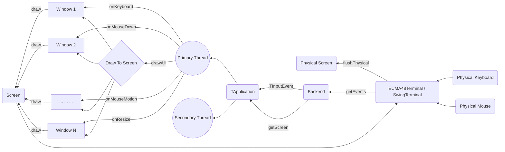
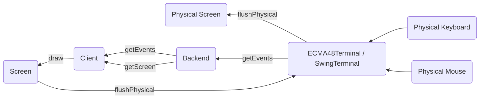

Jexer's High-Level Design
=========================

Jexer has three major areas of function: user-facing input/output (events and screen), window management (TApplication), and widgets (TWidget) and windows (TWindow).  This document describes in a general manner what these pieces do and how they communicate.

The Big Picture
---------------

Events And Screen
-----------------

Input and output to the "physical" devices occur via received *events* and updates to the *screen*:

* Events are received by calling jexer.backend.Backend.getEvents(), which puts any events into a list for higher layers to process.

* Backend.getScreen() returns a jexer.backend.Screen interface that has functions for drawing characters, strings, and lines to a logical screen buffer.  When it is time to push that logical buffer to the physical screen, Screen.flushPhysical() is called.  The SwingTerminal and ECMA48Terminal (Xterm) backends have logic to reduce the amount of actual data that must be drawn or emitted to the terminal.

Pictorially, the data flow looks like this:

The jexer.backend package can be used standalone to provide keyboard, mouse, and screen support for any kind of application.  For an example of using the Swing backend without any of the rest of Jexer, [see here](https://gitlab.com/klamonte/jermit/blob/master/src/jermit/ui/qodem/QodemUI.java).

Events are always concrete subclasses of abstract class jexer.event.TInputEvent.  In addition to mouse press/release/movement and keyboard presses, events are also generated for resizes (screen and widget), menu selection, and general-purpose "command" events.

Screens encapsulate a two-dimensional grid of cells.  Any number of actions can be performed on the screen, but none will be visible to the end user until flushPhysical() is called.

Screen and Backend are both interfaces, so interesting things can be done by composition:

* MultiBackend and MultiScreen multiplex a single TApplication to multiple terminals.  This is demonstrated by jexer.demos.Demo6: a single TApplication has *three* screens that can manipulate it: one Swing screen, one ECMA48 screen, and another Swing screen showing the application running inside a window.  Keyboard and mouse events from any of these screens will update all of them at once.  One could use MultiBackend/MultiScreen to build a detachable long-running application.

* TWindowBackend performs user I/O of a Backend within the window of a different TApplication.

Widgets And Windows
-------------------

Above the backend layer, Jexer organizes things into *widgets* (TWidget subclasses) and *windows* (TWindow subclasses).  The key principles of these objects are:

* TWidgets receive events and draw things to a TWindow.  A TWidget can have zero or many "child" widgets.  Every widget has a "parent" TWidget.  This hierarchy is used to route input events to the lowest-level widget to handle it.  On the drawing side, the hierarchy is drawn in a top-down manner, such that a parent widget draws what it needs first, and then its children are drawn, with each of those drawing its children, and so on.  TWidget.drawChildren() contains code that sets up offset and clipping, so that the TWidget.draw() methods can assume that coordinate (0, 0) is the top-left corner.

* TWindows organize TWidgets into layered panels that can be moved, resized, and hidden.  TApplication manages the TWindows, routing user events to the active window, and drawing them in reverse Z order so that the active window gets drawn last (painter's algorithm, with positive Z pointing away from the user: Jexer's coordinate system is right-handed).

Both TWidget and TWindow are legitimate "God classes", they each have code to do far more than a typical Java object should.  This is rather common for a windowing system, as there are a great many corner cases to a smoothly functioning mouse-supporting "graphical" user interface.

Most of Jexer's user interface elements are TWidget subclasses, intended to be composed to make bigger applications.  A few more complex elements are full windows: the operating shell terminal window (a vttest-passing terminal emulator in its own right, capable of running Jexer inside itself), font chooser, color theme editor, Java exception dialog, modal message box, and modal file chooser.  Some elements come in both flavors -- as a widget that can be put anywhere, and as a window that provides a good out-of-the-box experience: a text editor, image viewer, and data table.

Window Management
-----------------

A significant part of TApplication's code is managing multiple TWindows.

😻