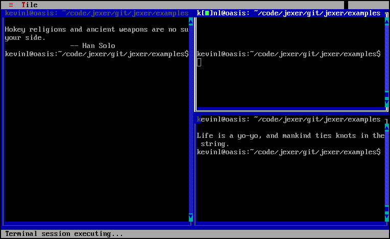
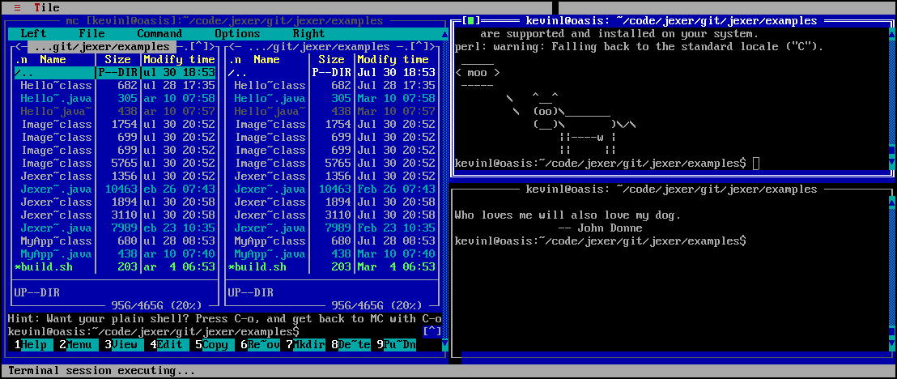
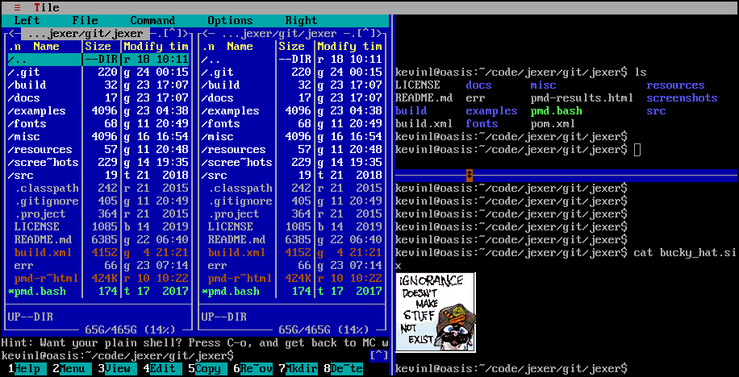

JexerTilingWindowManager
========================

Two short examples of using Jexer's built-in components to become a
bare-bones command-line tiling window manager are
[here](https://gitlab.com/AutumnMeowMeow/jexer/blob/master/examples/JexerTilingWindowManager.java)
and
[here.](https://gitlab.com/AutumnMeowMeow/jexer/blob/master/examples/JexerTilingWindowManager2.java)

The first example spawns terminal windows arranged similar to
horizontal/vertical splits in a multiplexer:

The second example uses TSplitPanes to achieve true resizable
horizontal/vertical splits with terminal widgets:

😻