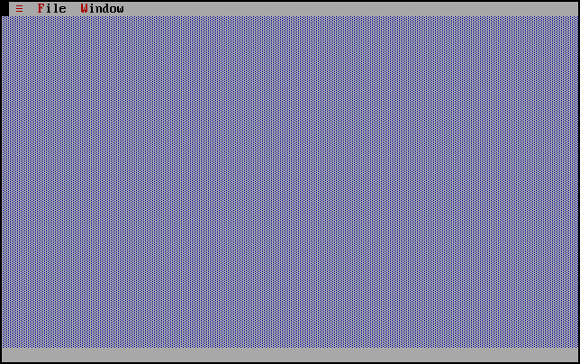
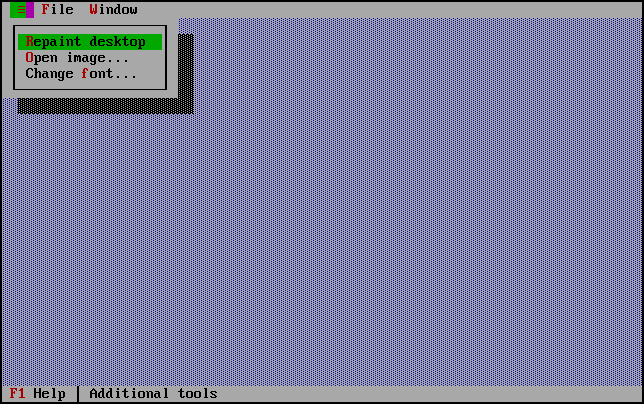
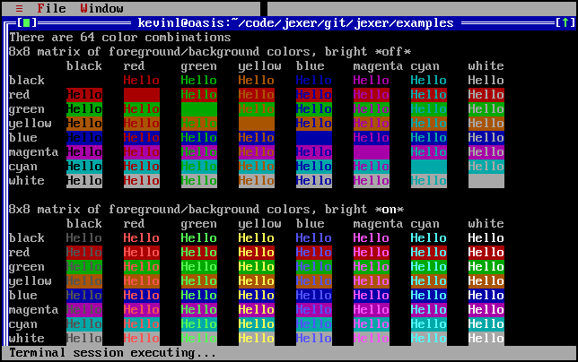
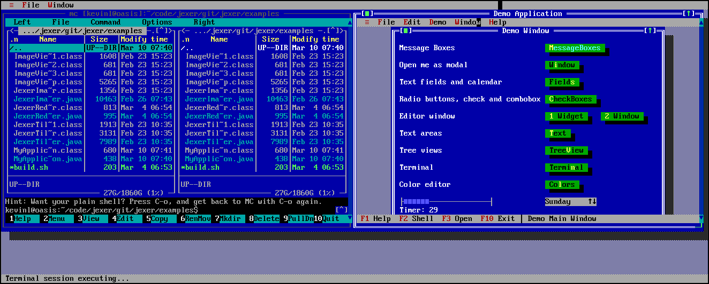
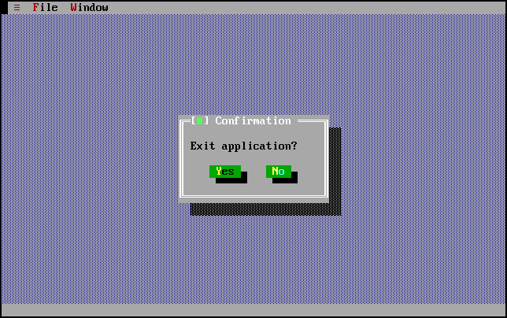

Hello World For Jexer
=====================

The following code below is all that is needed to create a basic application:

```Java
import jexer.TApplication;

public class MyApplication extends TApplication {

    public MyApplication() throws Exception {
        super(BackendType.XTERM);

        // Create standard menus for Tool, File, and Window.
        addToolMenu();
        addFileMenu();
        addWindowMenu();
    }

    public static void main(String [] args) throws Exception {
        MyApplication app = new MyApplication();
        app.run();
    }
}
```

Compile it with 'javac -cp path/to/jexer.jar MyApplication.java', and run it with 'java -cp path/to/jexer.jar:. MyApplication' .  (You can use your IDE to pull jexer from Maven, and just drop the code above into a new class called MyApplication.)

This will create an application with three menus:



The tools menu (with the hamburger icon on left) has items for repainting the desktop, opening an image file, and changing the font:



The file menu has options for spawning a terminal window and exiting.  It is important to have some means of exiting your application, especially for the Xterm backend.  (The Swing backend will automatically exit if you close the frame.)

You can use File-->OS Shell to spawn a terminal.  The terminal itself is a good one: it can pass vttest, handles keyboard and mouse, and can even run Jexer inside.  Here is shot of the vttest SGR colors screen:



Here is another shot where the host xterm window was made large enough for two terminal windows side-by-side, Midnight Commander running on the left terminal and the Jexer demo application running on the right:



When you are ready to exit, select File --> Exit, or press Alt-X.  This brings up a system-modal message box for confirmation:



Commentary
----------

This example has MyApplication subclass TApplication, and call some functions to add menus in its constructor.  One could also just create TApplication directly, and call the functions on it:

```Java
import jexer.TApplication;

public class HelloWorld {

    public static void main(String [] args) throws Exception {
        TApplication app = new TApplication(TApplication.BackendType.XTERM);
        app.addToolMenu();
        app.addFileMenu();
        app.addWindowMenu();
        app.run();
    }
}
```

This example demonstrates a core value of Jexer:  **Behave like Turbo Vision with as little hassle as possible.**

Jexer's design deliberately does not resemble Swing.  Jexer is not trying to be a general-purpose widget toolkit that can be skinned to look like anything, it is trying to be a best-in-class user experience that gets you (as the developer) going quickly on writing your application logic.

😻