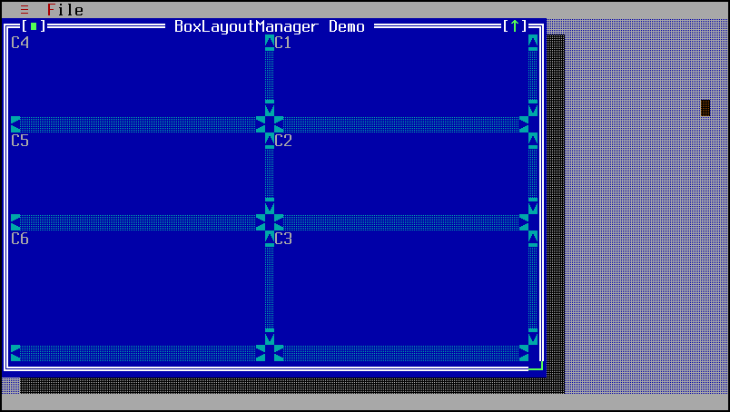

BoxLayoutManager
================

BoxLayoutManager repositions child widgets based on the order they are
added to the parent widget and desired orientation.

Screenshots
-----------

Below is Demo7, which uses BoxLayoutManager in horizontal layout to
organize two TPanels, and each TPanel has a BoxLayoutManager in
vertical layout to organize three TText widgets.



Examples
--------

The relevant code for the screenshot above is this:

```Java
TWindow window = new TWindow(app, "BoxLayoutManager Demo"), 60, 22);
window.setLayoutManager(new BoxLayoutManager(window.getWidth() - 2,
        window.getHeight() - 2, false));

TPanel right = window.addPanel(0, 0, 10, 10);
TPanel left = window.addPanel(0, 0, 10, 10);
right.setLayoutManager(new BoxLayoutManager(right.getWidth(),
        right.getHeight(), true));
left.setLayoutManager(new BoxLayoutManager(left.getWidth(),
        left.getHeight(), true));

left.addText("C1", 0, 0, left.getWidth(), left.getHeight());
left.addText("C2", 0, 0, left.getWidth(), left.getHeight());
left.addText("C3", 0, 0, left.getWidth(), left.getHeight());
right.addText("C4", 0, 0, right.getWidth(), right.getHeight());
right.addText("C5", 0, 0, right.getWidth(), right.getHeight());
right.addText("C6", 0, 0, right.getWidth(), right.getHeight());
```

API
---

[BoxLayoutManager API](https://jexer.sourceforge.io/apidocs/api/jexer/layout/BoxLayoutManager.html)

😻