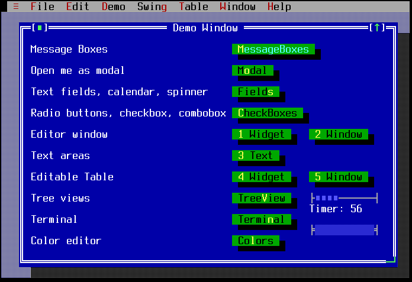
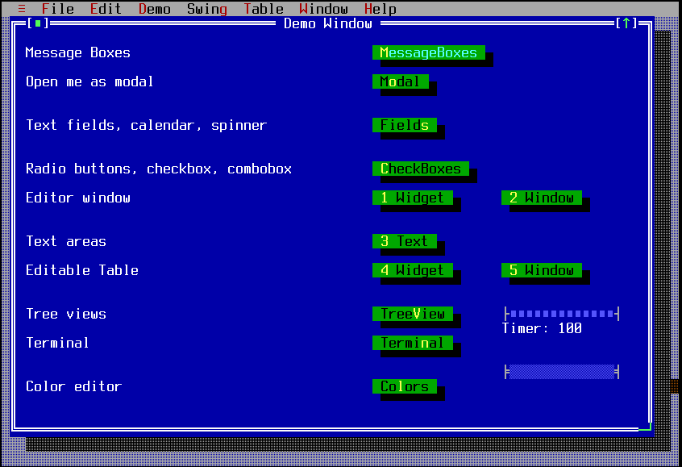
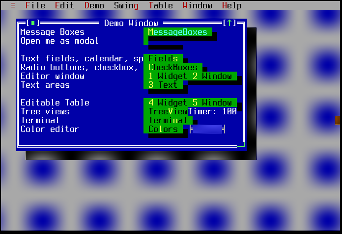

StretchLayoutManager
====================

StrechLayoutManager repositions child widgets based on their
coordinates when added and the current widget size.

Screenshots
-----------

Below is the normal demo main window.  The widgets are all initially
added using fixed coordinates.



When the window is made larger, the widgets' X, Y, width, and height
values are changed to be similar to the relative positions as they
were orginally were.



If the window is further shrunk, widgets can cover each other as seen
below.



Examples
--------

```Java
setLayoutManager(new StretchLayoutManager(width, height);
```

API
---

[StretchLayoutManager API](https://jexer.sourceforge.io/apidocs/api/jexer/layout/StretchLayoutManager.html)

😻