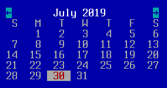

TCalendar
=========

TCalendar is a date picker widget.  It displays a calendar with the
day's date highlighted, and can optionally execute a TAction when
double-clicked or the user presses enter.


Screenshots
-----------



In the screenshot above, the user can click on a day to change the
date that calendar.getValue() will return, or on the arrows to change
the month.

Examples
--------

```Java
TCalendar calendar = addCalendar(x, y,
    new TAction() {
         public void DO() {
            messageBox("Calendar", "You selected " + calendar.getValue(),
                TMessageBox.Type.OK);
        }
    }
);
```

API
---

[TCalendar API](https://jexer.sourceforge.io/apidocs/api/jexer/TCalendar.html)

😻