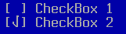

TCheckBox
=========

TCheckBox is an on/off checkbox with a label.  If the label has a
mnemonic (e.g. "C&heck me"), then pressing Alt-{key} will toggle the
value.  Pressing kbSpace will also toggle the value, and pressing
kbEsc will set the box to unchecked.


Screenshots
-----------



Examples
--------

```Java
addCheckBox(x, y, "C&heck me", false);
```

The above will add a checkbox that will toggle when the user presses
Alt-H.

API
---

[TCheckBox API](https://jexer.sourceforge.io/apidocs/api/jexer/TCheckBox.html)

😻