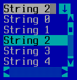

TComboBox
=========

TComboBox is a combobox that has a drop-down list and an edit field.
A TAction can also be executed when the field is updated.  Alt-Down
can be used to show the drop-down; kbEsc will close the drop-down.

Screenshots
-----------




Examples
--------

```Java
TComboBox comboBox = addComboBox(x, y, 12, comboValues, 2, 6,
    new TAction() {
        public void DO() {
            messageBox("ComboBox", "You chose: " + comboBox.getText(),
                TMessageBox.Type.OK);
        }
    }
);
```

API
---

[TComboBox API](https://jexer.sourceforge.io/apidocs/api/jexer/TComboBox.html)

😻