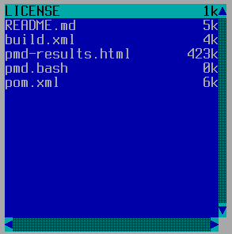

TDirectoryList
==============

TDirectoryList displays a list of files within a directory.  The
"action" TAction is executed when the user presses Enter or
double-clicks on an entry; the "singleClickAction" is executed when
the user single-clicks an entry.

Screenshots
-----------



Examples
--------

```Java
TDirectoryList list = addDirectoryList(path, x, y, width, height,
    new TAction() {
        public void DO() {
            // The action to perform when the user presses Enter
            // or double-clicks an item in this list.
        }
    },
    new TAction() {
        public void DO() {
            // The action to perform when the user single-clicks
            // an item in this list.
        }
    },
    filters);
```

API
---

[TDirectoryList API](https://jexer.sourceforge.io/apidocs/api/jexer/TDirectoryList.html)

😻