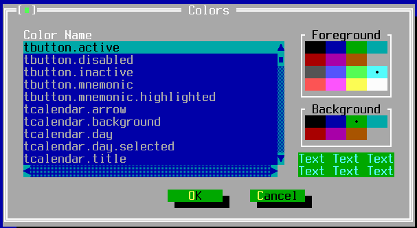

TEditColorThemeWindow
=====================

TEditColorThemeWindow provides a dialog window for users to alter the
running color theme.  The OK button saves changes to the color theme;
the Cancel button aborts changes.

See the ColorTheme API for functions to load and save the color
selections to file.

Screenshots
-----------



Examples
--------

```Java
new TEditColorThemeWindow(getApplication());
```

API
---

[TEditColorThemeWindow API](https://jexer.sourceforge.io/apidocs/api/jexer/TEditColorThemeWindow.html)

[ColorTheme API](https://jexer.sourceforge.io/apidocs/api/jexer/bits/ColorTheme.html)

😻