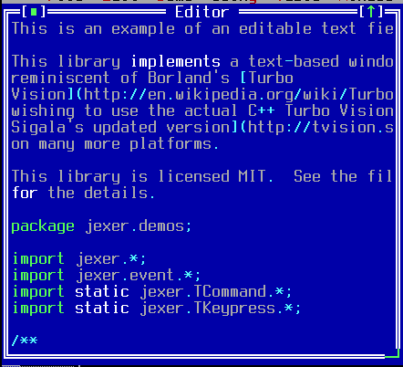

TEditorWidget
=============

TEditorWidget displays an editable text document.  It is unaware of scrolling behavior, but can respond to mouse and keyboard events.

Screenshots
-----------



Examples
--------

```Java
editField = addEditor("", 0, 0, getWidth() - 2, getHeight() - 2);
```

API
---

[TEditorWidget API](https://jexer.sourceforge.io/apidocs/api/jexer/TEditorWidget.html)

😻