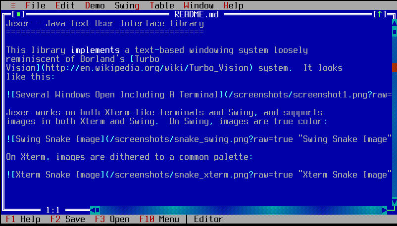
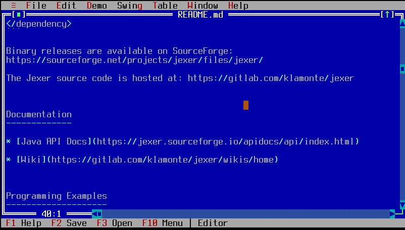

TEditorWindow
=============

TEditorWindow is a basic text file editor.

Screenshots
-----------





Examples
--------

```Java
new TEditorWindow(getApplication());
```

API
---

[TEditorWindow API](https://jexer.sourceforge.io/apidocs/api/jexer/TEditorWindow.html)

😻