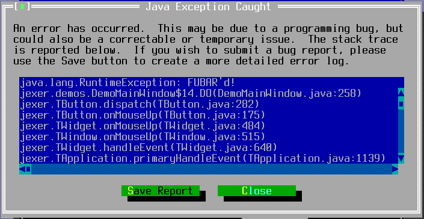

TExceptionDialog
================

TExceptionDialog displays an exception and its stack trace to the
user, and provides a means to save a troubleshooting report for
support.

Screenshots
-----------



Examples
--------

```Java
try {
    // Do something that might generate IOException...
} catch (IOException e) {
    // Show this exception to the user.
    new TExceptionDialog(this, e);
}
```

API
---

[TExceptionDialog API](https://jexer.sourceforge.io/apidocs/api/jexer/TExceptionDialog.html)

😻