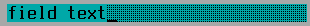

TField
======

TField is an editable input field with support for navigation (home /
end / left / right), insert/overtype mode, and copy/paste to
clipboard.  The "enterAction" TAction is executed when the user
presses Enter or double-clicks on an entry; the "updateAction" is
executed when the text is changed.

Screenshots
-----------



Examples
--------

```Java
addField(x, y, 15, false, "Field text");
```

API
---

[TField API](https://jexer.sourceforge.io/apidocs/api/jexer/TField.html)

😻