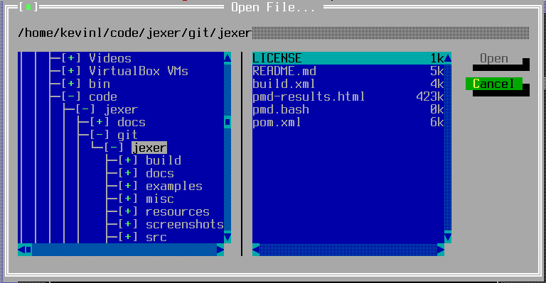

TFileOpenBox
============

TFileOpenBox is a system-modal dialog for selecting a file to open or save.

Screenshots
-----------



Examples
--------

```Java
filename = fileOpenBox("/path/to/file.ext", TFileOpenBox.Type.OPEN);
if (filename != null) {
    // ... the user selected a file, go open it ...
}
```

API
---

[TFileOpenBox API](https://jexer.sourceforge.io/apidocs/api/jexer/TFileOpenBox.html)

😻