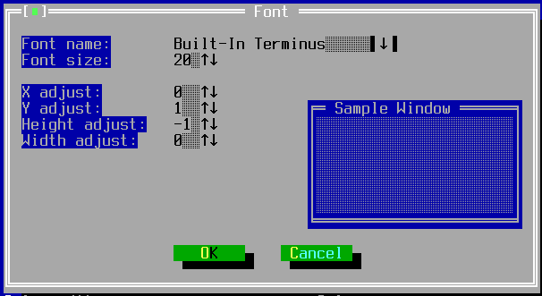
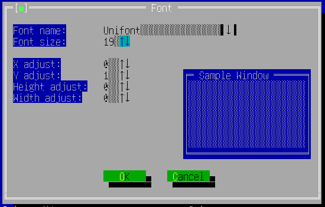
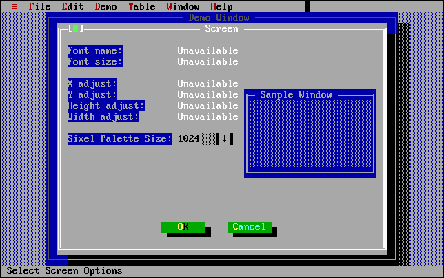

TFontChooserWindow
==================

TFontChooserWindow provides a dialog window for users to alter the
running font parameters (for Swing backend) and sixel properties (for
Xterm backend) .

DEPRECATED.  For releases after 0.3.2, use
[TScreenOptionsWindow](widget-tscreenoptionswindow) instead.

Screenshots
-----------







Examples
--------

```Java
new TFontChooserWindow(getApplication());
```

API
---

[TFontChooserWindow API](https://jexer.sourceforge.io/apidocs/api-0.3.2/jexer/TFontChooserWindow.html)
