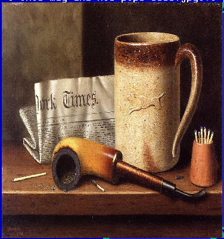

TImage
======

TImage renders a piece of a bitmap image on screen.  Keyboard bindings
are:

* Alt-Left, Alt-Right, '+', and '-' will zoom the image
  larger/smaller.

* Alt-Up and Alt-Down will rotate the image.

* Shift-Left and Shift-Right will select between scaling/stretch
  options.


Screenshots
-----------

An image loaded in TImage is shown below.  This is with no
scaling/stretching.  The pixels in the text cells that are not covered
by the image are black (the border at right and bottom).


The same image, but now with TImage.Scale.STRETCH scaling is shown
below.  All of the text cells are covered, but the image is distorted.



The same image, but now with TImage.Scale.SCALE scaling is shown
below.  The image is made as large as possible to fit the text area
maintaining its aspect ratio and centered.


Examples
--------

```Java
BufferedImage image = ImageIO.read(file);
TImage imageField = new TImage(this, 0, 0, getWidth() - 2, getHeight() - 2,
    image, 0, 0, null);
```

API
---

[TImage API](https://jexer.sourceforge.io/apidocs/api/jexer/TImage.html)

😻