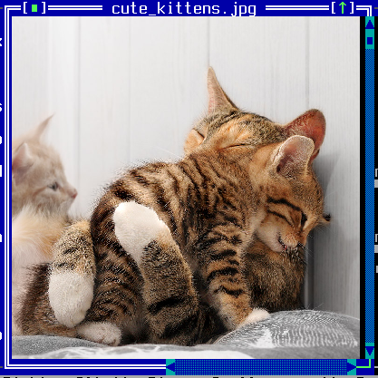
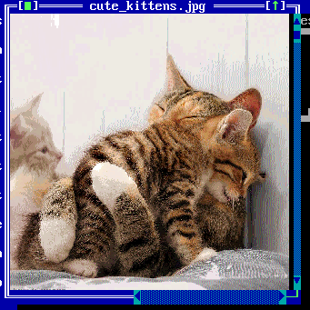

TImageWindow
============

TImageWindow shows an image with scrollbars.  Keyboard bindings are:

* Arrow keys pan image left/right/up/down.  PgUp/PgDn perform a larger
  pan up/down.

* Alt-Left, Alt-Right, '+', and '-' will zoom the image
  larger/smaller.

* Alt-Up and Alt-Down will rotate the image.

* Shift-Left and Shift-Right will select between scaling/stretch
  options.

Screenshots
-----------





Examples
--------

```Java
new TImageWindow(getApplication(), new File(filename));
```

API
---

[TImageWindow API](https://jexer.sourceforge.io/apidocs/api/jexer/TImageWindow.html)

😻