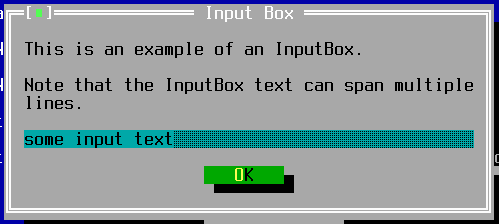

TInputBox
=========

TInputBox is a system-modal dialog with an OK button and a text input
field.

Screenshots
-----------



Examples
--------

```Java
TInputBox box = inputBox("Input Box Window Title", "Caption above input field");
if (box.getText().equals("yes")) {
    ... the user entered "yes", do stuff ...
}
```

API
---

[TInputBox API](https://jexer.sourceforge.io/apidocs/api/jexer/TInputBox.html)

😻