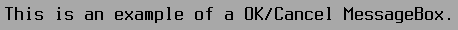

TLabel
======

TLabel implements a simple label, with an optional mnemonic hotkey
action associated with it.  A label will typically draw using its
container's window background color.

Screenshots
-----------




Examples
--------

```Java
addLabel("Something to say", x, y);
```

API
---

[TLabel API](https://jexer.sourceforge.io/apidocs/api/jexer/TLabel.html)

😻