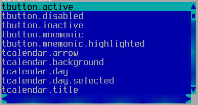

TList
=====

TList shows a list of strings, and lets the user select one.  The
"action" TAction is executed when the user presses Enter or
double-clicks on an entry; the "singleClickAction" is executed when
the user single-clicks an entry; the "moveAction" is executed when the
list is navigated by keyboard.

Screenshots
-----------



Examples
--------

```Java
addList(strings, x, y, width, height);
```

API
---

[TList API](https://jexer.sourceforge.io/apidocs/api/jexer/TList.html)

😻