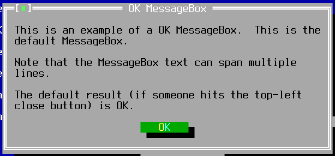
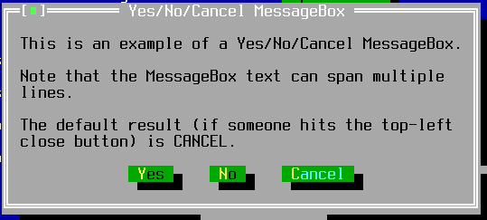

TMessageBox
===========

TMessageBox is a system-modal dialog with buttons for OK, Cancel, Yes, or No.

Screenshots
-----------





Examples
--------

```Java
TMessageBox box = messageBox(title, caption,
    TMessageBox.Type.OK | TMessageBox.Type.CANCEL);
if (box.getResult() == TMessageBox.OK) {
    // ... the user pressed OK, do stuff ...
}
```

The above example is equivalent to:

```Java
if (messageBox(title, caption, TMessageBox.Type.OK | TMessageBox.Type.CANCEL).isOk()) {
    // ... the user pressed OK, do stuff ...
}
```

API
---

[TMessageBox API](https://jexer.sourceforge.io/apidocs/api/jexer/TMessageBox.html)

😻