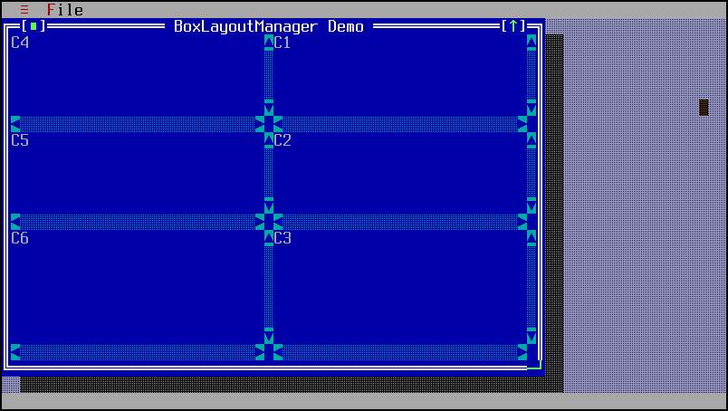

TPanel
======

TPanel is an empty container for other widgets.

Screenshots
-----------

Below is Demo7, which uses two TPanels to organize the left and right
sides of the grid of TText widgets.



Examples
--------

```Java
TPanel left = addPanel(x, y, width, height);
```

API
---

[TPanel API](https://jexer.sourceforge.io/apidocs/api/jexer/TPanel.html)

😻