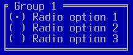
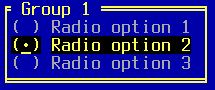

TRadioGroup
===========

TRadioGroup is a collection of TRadioButtons with a box and label.

Screenshots
-----------





Examples
--------

```Java
TRadioGroup group = addRadioGroup(x, y, "Group 1");
group.addRadioButton("Radio option 1");
group.addRadioButton("Radio option 2", true);
group.addRadioButton("Radio option 3");
group.setRequiresSelection(true);
```

API
---

[TRadioGroup API](https://jexer.sourceforge.io/apidocs/api/jexer/TRadioGroup.html)

😻