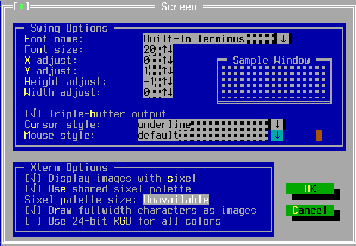
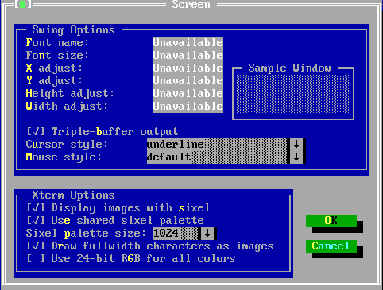

TScreenOptionsWindow
====================

TScreenOptionsWindow provides a dialog window for users to alter the
running font parameters (for Swing backend) and sixel properties (for
Xterm backend) .

Screenshots
-----------





Examples
--------

```Java
new TScreenOptionsWindow(getApplication());
```

API
---

[TScreenOptionsWindow API](https://jexer.sourceforge.io/apidocs/api/jexer/TScreenOptionsWindow.html)
