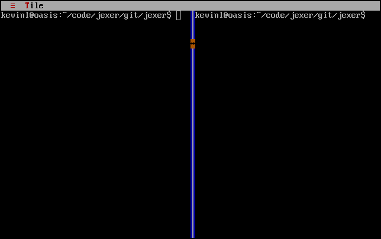
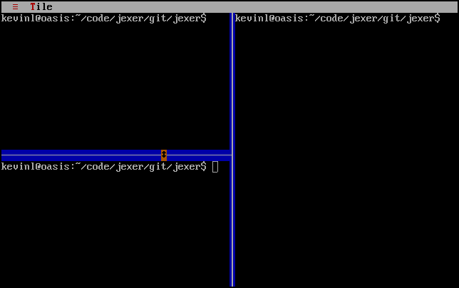

TSPlitPane
==========

TSplitPane is a container for two widgets with a mouse-resizable
divider between them.  The split can be either horizontal or vertical.
Convenience methods are provided to refer to the left and right
widgets in a vertical split, or the top and bottom widgets of a
horizontal split.

Screenshots
-----------

The JexerTilingWindowManager2 example shows vertical and horizontal
splits with TTerminalWidgets.  The screen below shows a vertical
split.



The screen below shows two splits: a vertical split containing a
horizontal split on its left, and a terminal on it right.



Examples
--------

```Java
addSplitPane(x, y, width, height, true);
```

API
---

[TSplitPane API](https://jexer.sourceforge.io/apidocs/api/jexer/TSplitPane.html)

😻