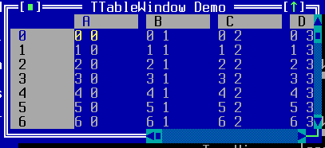
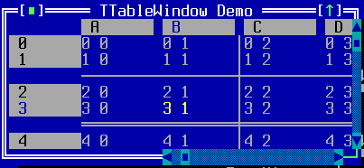

TTableWidget
============

TTableWidget is used to display and edit simple two-dimensional tables
of cells.

Screenshots
-----------





Examples
--------

```Java
addTable(x, y, width, height, tableColumns, tableRows);
```

API
---

[TTableWidget API](https://jexer.sourceforge.io/apidocs/api/jexer/TTableWidget.html)

😻