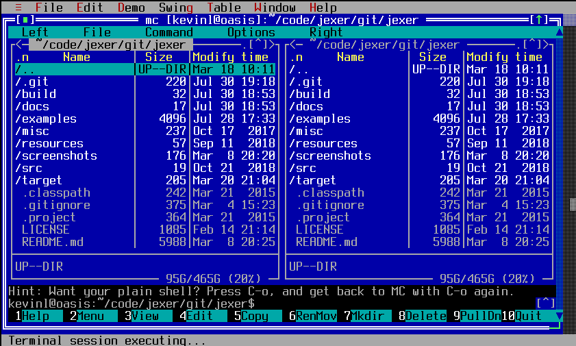
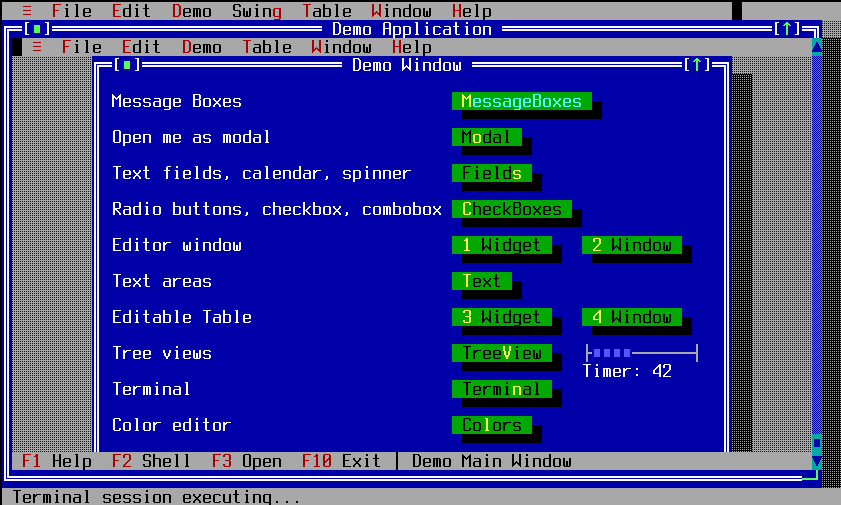
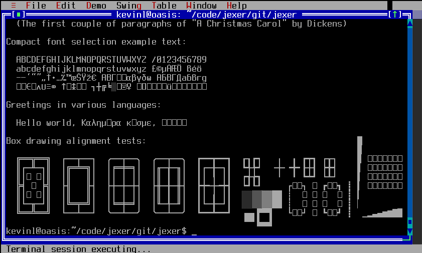
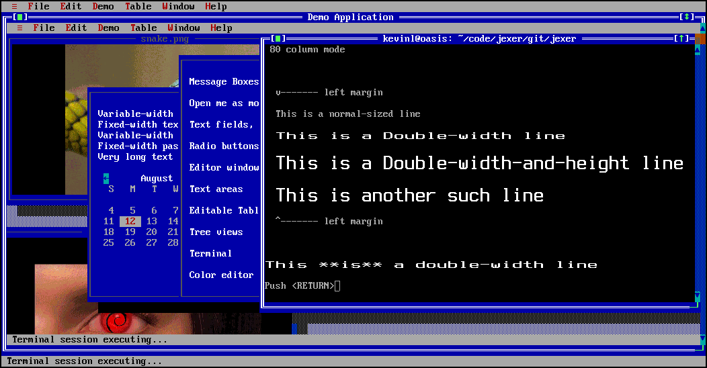
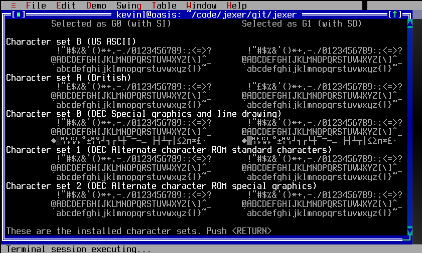
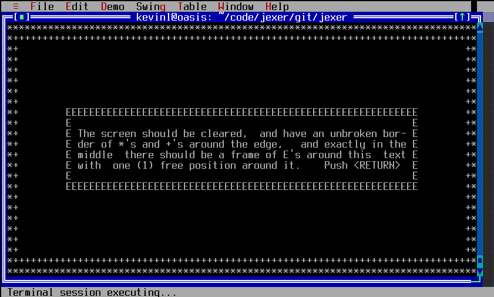
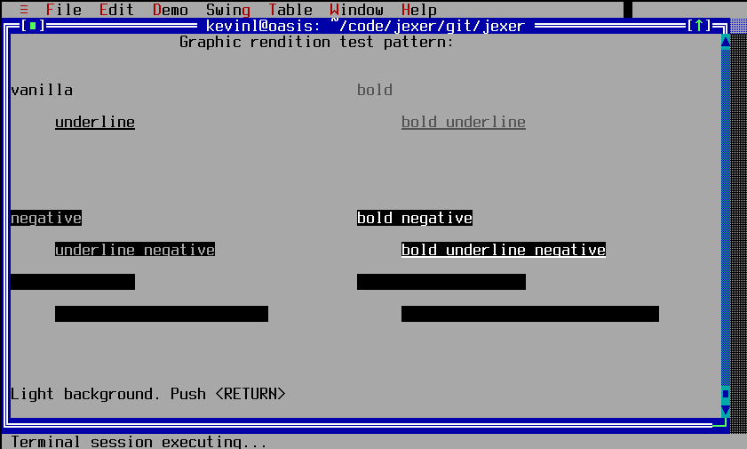
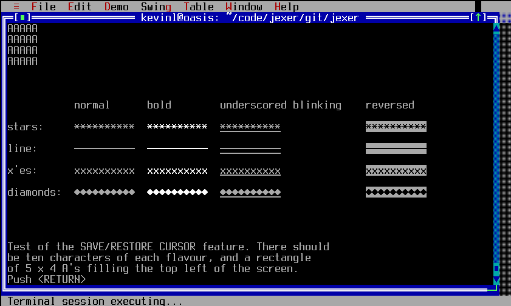
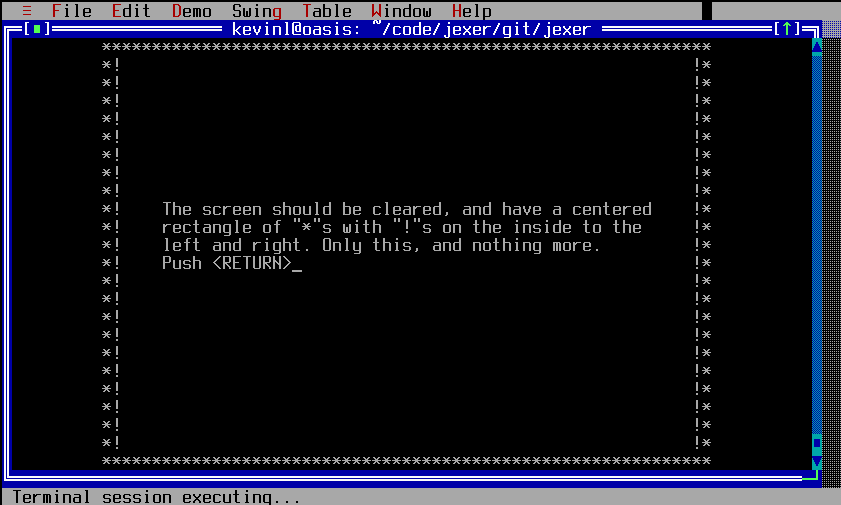
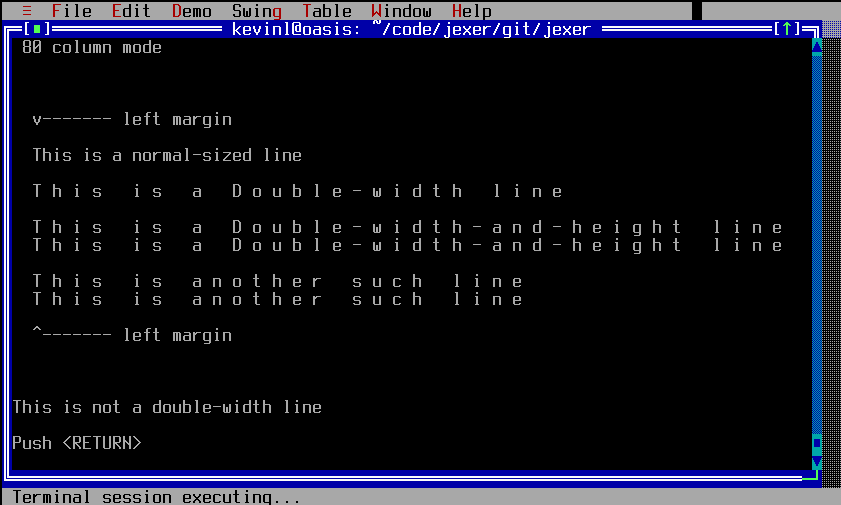

TTerminalWidget
===============

TTerminalWidget is a full-featured ECMA-48/ISO 6429/ANSI X3.64 type
console window, including a scrollback buffer.  It implements nearly
all of VT100, VT102, and VT220 faithfully, and enough of XTERM to
support terminfo-based applications and Jexer itself.  TTerminalWidget
can spawn a login shell or run any arbitrary command in a shell
window.  To the best of my knowledge, TTerminalWidget is also the only
terminal widget available that can produce true
double-width/double-height and sixel images while running itself
inside xterm.

ptypipe
-------

[ptypipe](https://gitlab.com/AutumnMeowMeow/ptypipe) executes a shell
inside a new TTY, and can notify the shell when the TTerminalWidget is
resized.  It looks for the dtterm/xterm window size sequence, and if
seen executes ioctl(TIOCSWINSZ).

To use ptypipe, set the System property "jexer.TTerminal.ptypipe" to
"true" before calling TTerminalWidget's constructor.

Examples
--------

```Java
new TTerminalWidget(window, 0, 0, width, height,
    new TAction() {
        public void DO() {
            // This action will be executed when the shell process exits.
        }
    });
```

Screenshots
-----------

There are a lot of screenshots below showing off TTerminalWidget's
capabilities.  Jexer's terminal is quite good, exceeding the
VT100/VT220 faithfulness of many popular terminals.

We start with the classic mc:



Next we show a second instance of Jexer running inside a window.  The
Jexer instance in the window has full mouse support including
dragging/resizing windows.



The terminal expects UTF-8, and when using a font with the glyphs one
will see proper box-drawing characters:



The terminal's color palette matches CGA/EGA/VGA, with "dark yellow"
showing as brown:


But if you really want some bling, check out Jexer running inside its
own terminal widget with images and double-width characters:



The remaining screens show off Jexer's jexer.tterminal.ECMA48 vttest
compliance.  Beginning with the VT100 special graphics characters
correctly translated to Unicode:



The cursor movements test:



Bold, underline, blinking, and reverse color.  The bold + reverse
colors behave as they would on CGA/EGA/VGA (where the bold attribute
is only on the foreground color) rather than Xterm (where bold +
reverse will apply the bold to the background color):



The save/restore screen:



VT52 sub-mode support.  Jexer is (to the best of my knowledge) the
only terminal multiplexer to support this:



Double-width support.  When TTerminalWidget is running against
MultiScreen, it does not know if it has image support, so displays
double-width and double-height characters with spaces rather than true
double-width/height:




API
---

[TTerminalWidget API](https://jexer.sourceforge.io/apidocs/api/jexer/TTerminalWidget.html)

😻