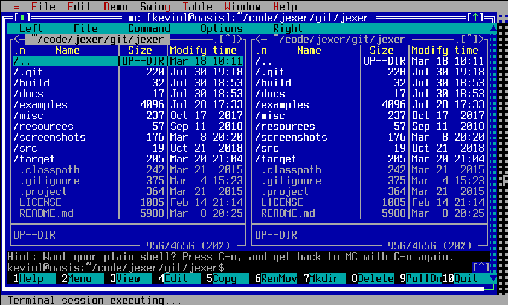
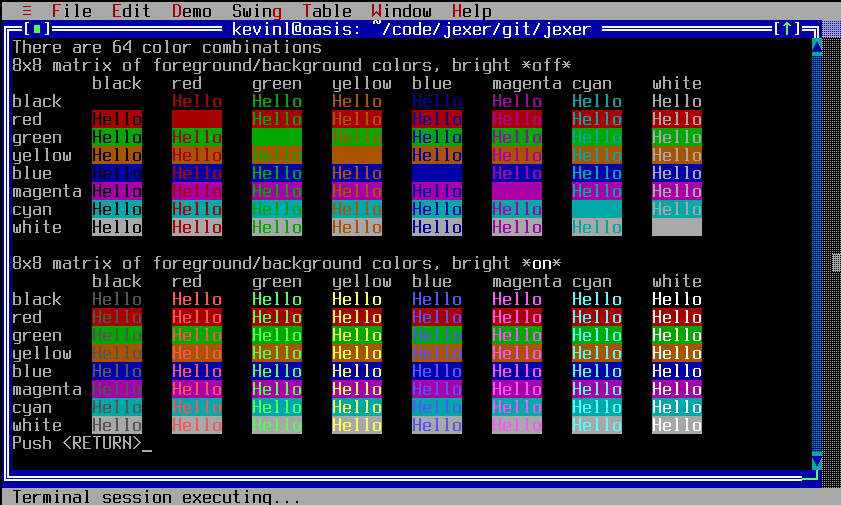
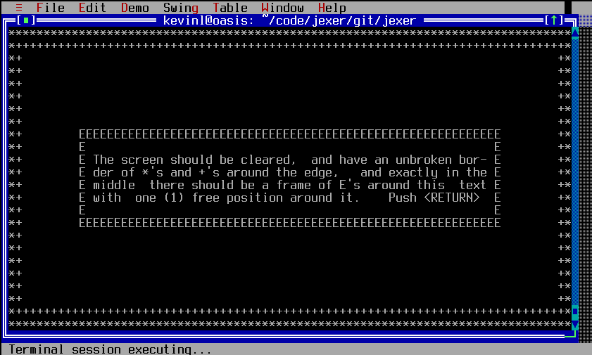
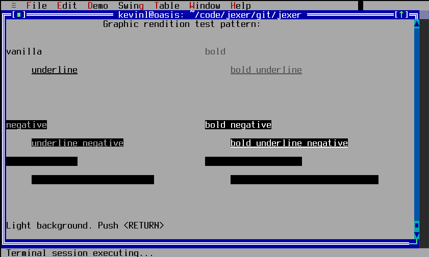
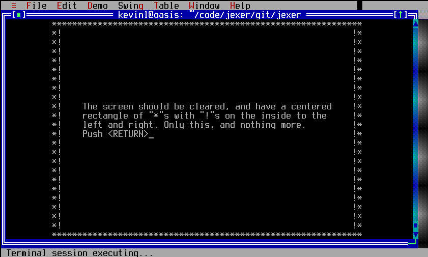
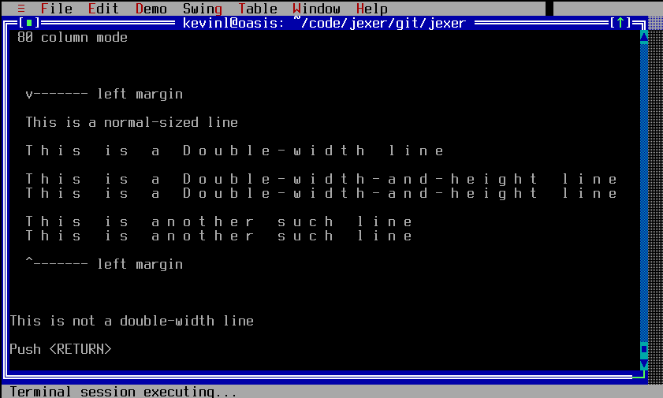

TTerminalWindow
===============

TTerminalWindow is a complex ECMA-48/ISO 6429/ANSI X3.64 type console window, including a scrollback buffer.  It implements nearly all of VT100, VT102, and VT220; and enough of XTERM to support terminfo-based applications and Jexer itself.

ptypipe
-------

Screenshots
-----------

Examples
--------
