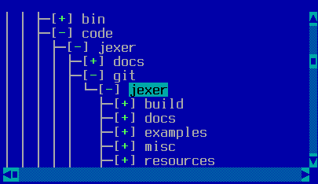
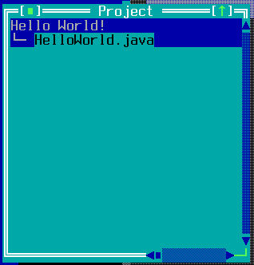

TTreeView
=========

TTreeView is a simple tree view, provided as either a widget
(TTreeViewWidget) or a window (TTreeViewWindow).

Screenshots
-----------





Examples
--------

```Java
treeView = addTreeViewWidget(x, y, width, height);
new TDirectoryTreeItem(treeView, ".", true);
```

```Java
public class ProjectWindow extends TTreeViewWindow {

    private ProjectWindowTreeItem root;

    public ProjectWindow(final TApplication parent, final Project project) {

        super(parent, i18n.getString("windowTitle"),
            project.getWindowLeft(), project.getWindowTop() - 1,
            project.getWindowWidth(), project.getWindowHeight(),
            RESIZABLE | ABSOLUTEXY, null);

        // Load the treeview
        root = new ProjectWindowTreeItem(this, project);
        for (Target target: project.getTargets()) {
            root.addChildTarget(this, target);
        }
        reflowData();
}
```

API
---

[TTreeViewWidget API](https://jexer.sourceforge.io/apidocs/api/jexer/ttree/TTreeViewWidget.html)

[TTreeViewWindow API](https://jexer.sourceforge.io/apidocs/api/jexer/ttree/TTreeViewWindow.html)

😻