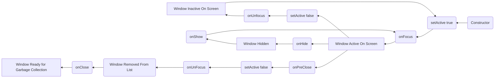

TWindow
=======

TWindow is the top-level container and drawing surface for other widgets.

TWindow is a very special class, serving as the fundamental glue
between TWidget and TApplication:

* Events are only routed to widgets that have windows.

* Widgets can only access the TApplication and Screen through their
  parent window.

* Windows can be system-modal: receiving all events and drawn on top
  of all other windows.


Window Lifecycle
----------------



Examples
--------

```Java
application.addWindow("Window title", x, y, width, height);
```

API
---

[TWindow API](https://jexer.sourceforge.io/apidocs/api/jexer/TWindow.html)

😻